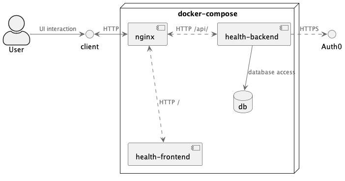

# Health Records App

This app is designed to make it easy to create, review, and share your Personal Health Records.

This application is composed of a **Vue** single page application frontend, and a **fastAPI** backend, using a **postgres** database, and **Auth0** for authentication.
The application is deployed using **docker** containers, with automatic builds/releases using **Github Actions**, and automatic deployment using Watchtower, for a full **CI/CD pipeline**.

## Application architecture

### Components

- nginx server: accepts http requests at health.timhunter.dev and routes them to the frontend and backend.
- health-backend: API for data access. Communicates with internal postgres db and Auth0 service.
- health-frontend: Vue application for user-facing interactions.
- db: postgres database initialized by health-backend

